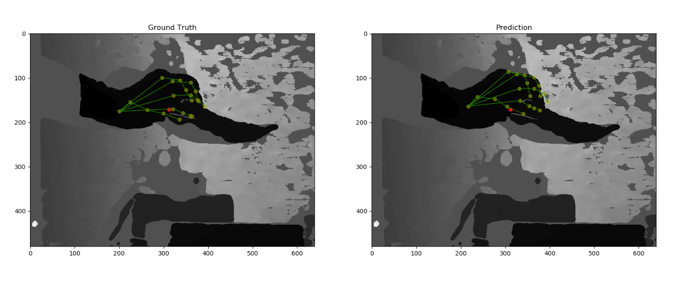
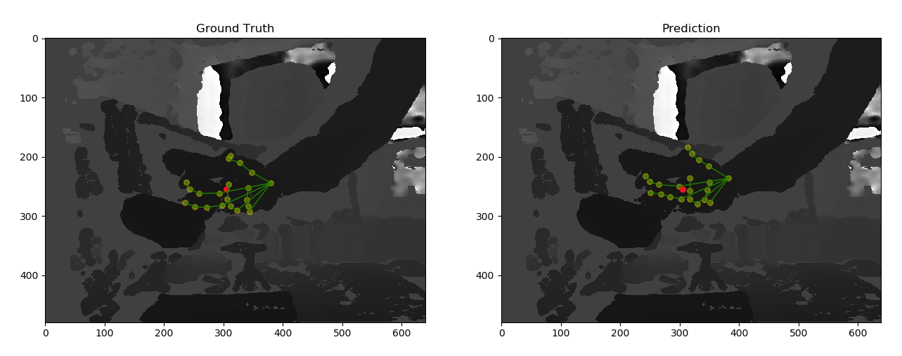

# 3D Hand Pose & Shape Estimation for hand-object interaction dataset from single depth image

## Dataset

We are using recently published dataset of hand-object interaction

[HOnnotate: A method for 3D Annotation of Hand and Objects Poses](https://www.tugraz.at/institute/icg/research/team-lepetit/research-projects/hand-object-3d-pose-annotation/)

**Complexity:** Hand poses are complex and mostly occluded with objects. Objects can have many different shape and pose which makes the problem harder

**Data format:** Single monocular depthimage

### Qualitative Results--

**sample depth images**

 

**Pose Prediction Result**

 

**Shape Prediction Result**

 

 

**Sparse to Dense shape**
 

 

******Detail will be updated after completion of the project******

##### HOnnotate Gitlab Challenge Link [here](https://competitions.codalab.org/competitions/22485#results)

