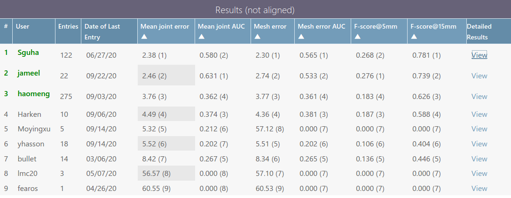

# 3D Hand Pose & Shape Estimation for hand-object interaction dataset from single depth image

## Approach

Overall architecture of our proposed method. HO_PNet takes voxelized depth map and estimates 3D heat map of hand joints and object bounding box. A resized voxelized depth map is concatenated channel wise with the predicted heatmap from HO_PNet. This is passed to HO_VNet that produces voxelized shape. This is used to enrich voxelized depth map and then concatenated channel wise with the predicted heatmap. This is passed as input to HO\_SNet that directly regress hand and object surface points.

## Dataset

We are using public hand-object interaction dataset HO3D published by:

[HOnnotate: A method for 3D Annotation of Hand and Objects Poses](https://www.tugraz.at/institute/icg/research/team-lepetit/research-projects/hand-object-3d-pose-annotation/)

#### A few images from the dataset:

**Complexity:** Ariculated hand poses are complex and mostly occluded with objects. Objects can have many different shape, size and orientation which makes the problem much harder than only isolated hand pose and shape estimation.

**Data used:** Single depth image.

### Quantitative Results:

Evaluation metrics for hand on withheld evaluation dataset as present in the codelab challenge. "Sguha" refers to our submission which is leading other submissions for both hand key points and hand mesh at the time of this experiment.

##### HOnnotate Gitlab Challenge Link [here](https://competitions.codalab.org/competitions/22485#results). "Non Aligned" table is applicable for our approach.

### Qualitative Results:

**Pose Prediction Result**

 

Pose estimation results for hand and object on validation set. **1st column:** 2D projection of ground truth pose. **2nd column:** 2D projection of predicted pose. **3rd column:** 3D representation of ground truth pose. **4th column:** 3D representation of predicted pose. Hand keypoints and object keypoints have been connected to visualize the hand skeleton and object bounding box.

**Shape Prediction Result**

Shape estimation results for hand and object on validation set. **1st column:** 2D projection of ground truth shape vertices. **2nd column:** 2D projection of predicted shape vertices. **3rd column:** 3D representation of ground truth shape vertices. **4th column:** 3D representation of predicted shape vertices.

**Mesh Reconstruction**

Reconstruction of hand and object mesh on validation set. The meshes are reconstructed from the shape vertices.

